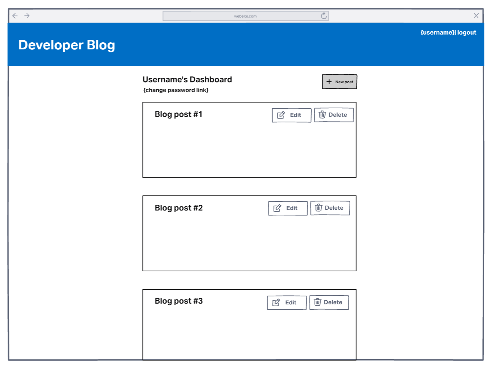
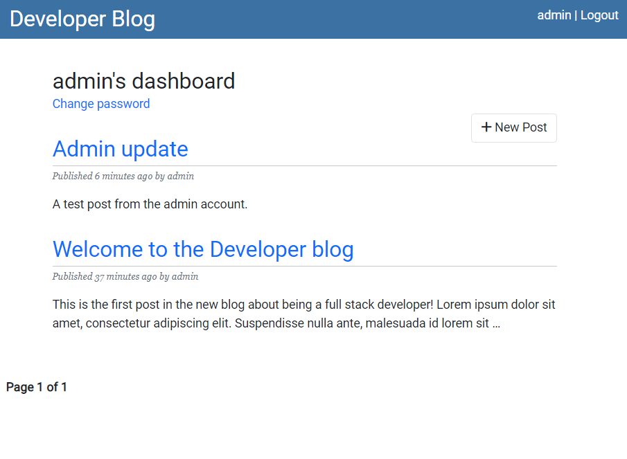

# Developer Blog

[Link to deployed site.](https://ms4-django-blog.herokuapp.com/)

A resubmission of my Django blog project. This document details the changes made to the project since the first submission. The unchanged, original Readme.md can be [found here](https://github.com/finnahern/dev-blog/blob/main/originalREADME.md).

The updated documentation below will detail changes made since the original version of the site.

# UX/Design

One of the bigger failures of the original submission was the poor user experience at the front end due to bad planning and time constraints leading to prioritising minimum functionality above everything else. I went back to the drawing board and created some simple wireframes of an updated version of the existing site (built using [Invision](https://www.invisionapp.com/)). This new design should be achievable with some simple Bootstrap formatting and make for a much more user friendly experience.

Below you can see the updated dashboard screen in line with the envisioned wireframe design. This new design is much more visually appealing as well as inviting to the user to engage with the CRUD functionality by changing the New Post function to a button from a plain link. The Edit and Delete buttons have been moved to the post detail screen and can only be accessed by the post's author, or by a super user in the case of the delete button.

# Agile development

One of the shortcomings of the original submission was a failure to properly demonstrate the use of Agile tools to plan and document developement. As it's difficult to retroactively document the original process, I have instead focused on detailing all of the changes made in this revision as well as noting down user stories to describe potential use cases for the site.

## User stories

As a user I want to be able to:

- Browse existing blog posts in a simple and intuitive manner.
- Register an account so I can participate in the site.
- Create new blog posts once I've signed in.
- Edit and delete my own blog posts. 

As the site administrator I want to be able to:

- Moderate the site's content by deleting unsuitable posts by other users.

# Testing

## Manual testing

I have manually tested each feature of the site throughout development as well as a final pass after the code was completed. Full details of which can be found [here]().

## Validation

All Python code in the project has succesfully passed [PEP8 validation](http://pep8online.com/) without any errors that would affect the functioning of the code. Most files passed without any problems at all and those that didn't were mostly limited to "line too long" errors.

## Bugs fixed

As part of this revision of the original project I have implemented an imperfect but workable solution to the duplicate urls error when generating slugs for the blog posts detailed in the original readme. In addition to the date a post was made being used to create a url, I have also added the hour and minute of creation as well. This method means that it's still possible to create duplicate urls, but it requires two blog posts with the same title to be created in the same minute as each other which seems unlikely enough to not be a concern though a more airtight solution would be needed if large amounts of traffic were anticipated. I would probably use something like [UUID](https://docs.djangoproject.com/en/4.0/ref/models/fields/#uuidfield) to generate a unique id number for each post when it's created if I were to start over.

## Known issues

# Deployment

The [same deployment](https://github.com/finnahern/dev-blog/blob/main/originalREADME.md#deployment) described in the original readme was used for this revision. No changes were needed.

# Credits

In addition to the technologies detailed in the original readme, [Django-humanize](https://docs.djangoproject.com/en/4.0/ref/contrib/humanize/) was used to make the creation date of the blog posts more readable.