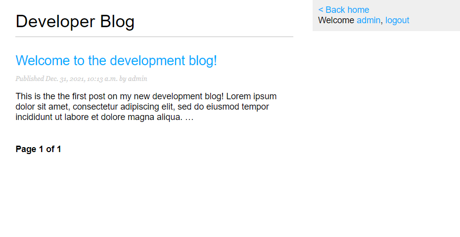

# Developer Blog

[Link to deployed site.](https://ms4-django-blog.herokuapp.com/)

A project using Django to create an interactive blog website about being a new full stack developer. The Django app uses a Postgres database to store information on users and blog posts using a custom data model.

Flowchart of the site navigation

## Features

- ### Custom data model for blog posts

The main purpose of the site is to view and create blog posts and for this I needed a data model to use in the database. Below is the Post model used in the project. Each post instance features a title, slug, which is used to create the post's unique url, author, body, dates for when it's published, created and updated, and it's status, either "draft" or "published".

- ### Functions for users to register for accounts, log in and out, and change their password

The site invites the user to register for an account and begin creating posts. This can be done quickly and easily using the site's registration, login and password change forms.

- ### Sidebar

The sidebar is visible on all pages of the site, confirming login status to user and allowing them to logout, or access their dashboard by clicking their username.

- ### Homepage/Blog post list

Users are first greeted with the home page which lists a preview of all post objects from the database from the newest descending. The page features pagination so if there are more than 4 posts in the database it will create secondary pages with navigation links. Each post on the list features the title of the post, which is a link to individual post's view page, the publish date and time, the author and a truncated preview of the first 30 words.

- ### User dashboard

The user's dashboard can be reached from any page of the site by clicking on the username in the sidebar. If the user is not signed in and try to go straight to the dashboard url they will be redirected to the login page. 

The dashboard is a lot like the homepage except it can only be accessed once the user has logged in. It's list only features posts belonging to the currently signed in user. From here the user can change their password, create a new post, and they can view, edit or delete one of their existing posts. Like the home page, the dashboard also features pagination for more than 4 posts.

- ### Post view

When the user clicks on the title of a post, either from the home page or from their dashboard where they are brought to the post view screen. Each post has a unique url generated using its created date and slug properties where this page is hosted. From here the user can read the full body of the post.

- ### Full CRUD functionality for posts

As mentioned above the dashboard completes the CRUD functionality for the user's own posts. From there they can create a new post or edit an existing one using a simple form, as well as delete unwanted posts.

## Agile methodology
I used the Github project board and Trello to plan and guide the development of the project using an interactive to do list to keep track of tasks in progress and user stories.

## Testing
I have manually tested a number of aspects of the program, particularly the elements that require a user input to ensure all input is validated and invalid input is handled appropriately. Manual testing was undertaken both in the deployed Heroku terminal and the one in the Gitpod IDE.

Below I've detailed some of the bugs I encountered during development that have been fixed. Unfortunately there are some issues I became aware of that I was not able to resolve due to time contraints, these are also mentioned below.

### Bugs identified and fixed
- Password links/redirects not working - The first version of the login/logout urls did not work properly. Django would throw an error whenever it tried to render a page featuring a link to them (which was every page due to the sidebar in the base.html template). This was resolved by changing the urls from "login"/"logout" to "blog:login"/"blog:logout".

- When the user submitted the password change form Django would throw an error. Manually navigating back to the home page using the browser's address bar and trying to login again revealed that the password had been changed successfully, the issue was just with redirecting the user to the confirmation page afterwards. I resolved this by added the '(success_url="/password_change/done")' argument to the password change path in urls.py.

### Unresolved issues
- Late in development I discovered a major bug that can render the site inoperable. The url for the individual posts are generated from slugs which are created using the date the post was created and its title. The Django administrator backend ensures that these slugs are unique, but the site's forms for adding or editing posts do not. This means that the user can create a post an indentical title to one already created that day which gives it an identical slug. Once this happens the url doesn't work because Django can't tell which object it needs to get and it throws an error instead of rendering a page that features a link to either post. This includes the home page and the user's dashboard. This issue can probably be fixed by using [Django 4.0's unique constraints](https://docs.djangoproject.com/en/4.0/ref/models/constraints/0) to ensure that when a user submits a form to add or edit a post that its slug is unique and prevent the database from being changed if not.

- Similar to the above the add/edit forms do not check for symbols in the title which create invalid slugs. Defensive programming in the add and edit views can check for symbols in the title and remove them from the generated slug.

- There is no defensive programming when deleting posts. Clicking the delete link in the dashboard immediately erases the post from the database without asking for confirmation from the user. This is poor UX and can lead to preventable data loss.

### Improvements to make
As well as resolving the issues mentioned above if I had more time to improve the site there are a number of features I would like to add, such as:

- Custom styling, using [Bootstrap](https://getbootstrap.com/docs/3.4/css/) or [Materialize](https://materializecss.com/), to create a more intuitive and pleasing to use UI.
- Completing the drafts feature planned in the data model so users can save posts before publishing them.
- Comments/likes to interact with posts
- Plugins like [Summernote](https://summernote.org/) or [Crispy Forms](https://django-crispy-forms.readthedocs.io/en/latest/) to improve UX for forms.

### Validator testing
The Python code was validated using the [Pep8](http://pep8online.com/) validator. The only errors returned were a number of "line too long" and "continuation line under-indented for visual indent" errors, that don't interfere with the program logic.

## Deployment

The project was deployed using Heroku with a PostgreSQL database.

### Steps for deployment

- Create a new Heroku app
- Install the Heroku Postgres Add-on
- Ensure Config Vars, such as DATABASE_URL and SECRET_KEY are configured correctly in setting.py
- Link the Heroku app to the Github repository
- Click deploy

## Credits

### Acknowledgements

Spencer Barriball for his feedback and advice and recommending invaluable resources

Anton Shmatov for letting me bounce questions off him and providing helpful support and advice.

### Technology used
- [Django 4.0](https://docs.djangoproject.com/en/4.0/)
- [Python](https://www.python.org/)
- HTML
- CSS
- [PostgreSQL](https://www.postgresql.org/) - Database used to store data models
- [Gunicorn](https://gunicorn.org/)
- [WhiteNoise](http://whitenoise.evans.io/en/stable/) - Allows gunicorn to serve the static css file
- [Git](https://git-scm.com/) - Version control.
- [Github](https://github.com/) - Used to host repository and live site.
- [Gitpod IDE](https://gitpod.io/) - Development enviornment used to build site.
- [Pep8 validator](http://pep8online.com/) - Used to validate code and check for errors.

### Resources

- [Django 3 By Example - Third Edition by Antonio Melé](https://www.packtpub.com/product/django-3-by-example-third-edition/9781838981952)
- [Django 4.0 Documentation](https://docs.djangoproject.com/en/4.0/)
- [W3Schools](https://www.w3schools.com/)
- [Stackoverflow.com](https://stackoverflow.com/)

### Code used
- The CSS stylesheet used is this project was taken from the Django blog example from chapter 1 of Django 3 By Example. I had intended to fully customise the style and UI of the site but due to time constraints I had to prioritise functionality of the site over UX.